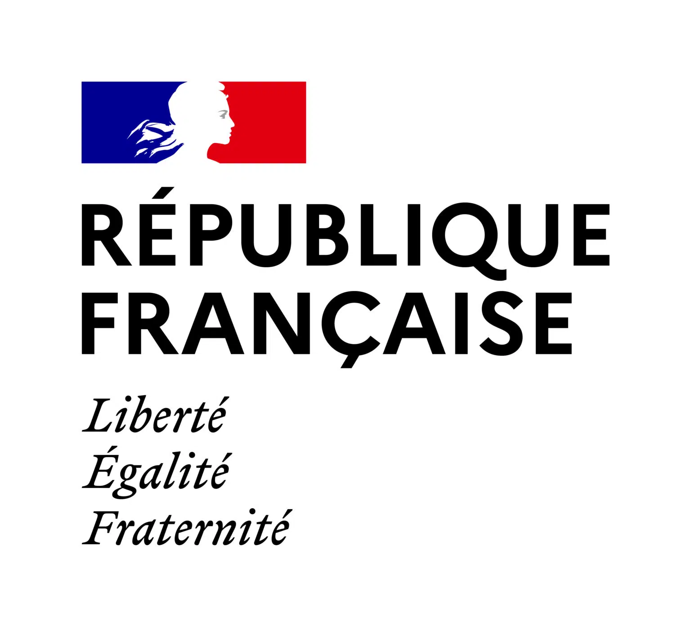
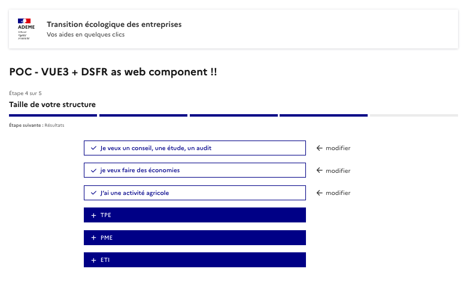
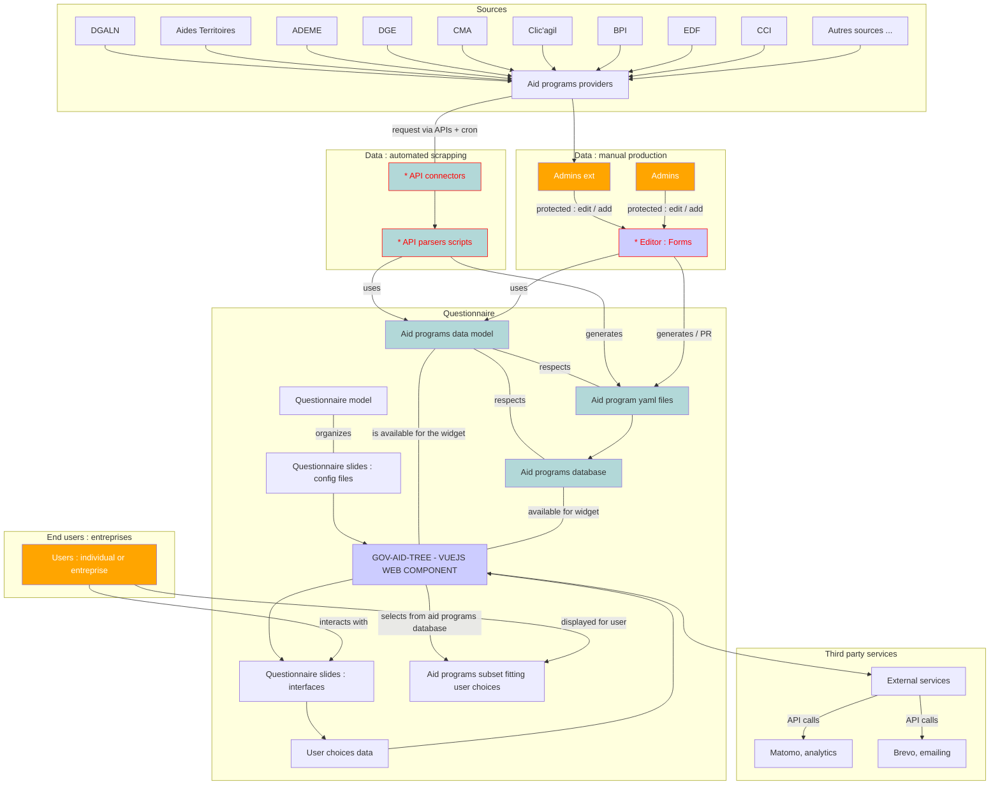
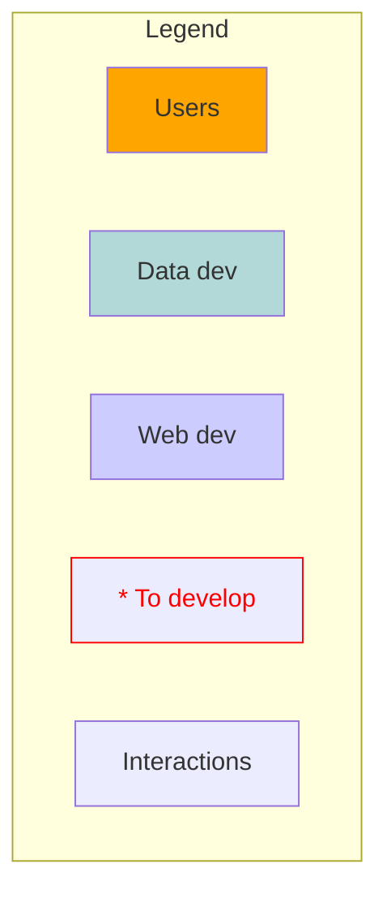

#  GOV-AID-TREE 

**Decision tree interfaces + fit with a database** 

[](https://app.netlify.com/sites/gov-aid-tree-poc/deploys)


---

## `WARNING : work in progress`

---

**A web component to help french entreprises finding public aid programs for their ecological transition.**

A project from the `transition-ecologique-entreprises` SE team.

---

<div style="display: flex; flex-direction: row;">
  
  
  
  
</div>

---

## Screenshots



---

## Why this web component ?

This project aims to implement a flexible but simple way to display a questionnaire in a portable web component, and use the user's choices to select a subset from a dataset.

### Main challenges

#### 1. Making and updating an official aid programs dataset

Our first usecase points at the difficulty for french entreprises to find public aid programs helping them to engage in an ecological transition. 

Such aid programs could be created at every administrative level (national, regional, local) by a wide diversity of actors.

Public aid programs are also very diverse : some could have conditions, some are limited in time, some are sectorial, some are limited to a geographic area, and so on...

To make a wide dataset of public aid programs we account for some necessary steps :

- Propose a schema to describe any aid program.
- Propose and implement a script able to regularly get and update the list of aids from providers, respecting the schema.
- Publish those aids in a way it is simple to request.

#### 2. Simplifying the research for end users

End users could be easily lost in the aid programs "jungle". The most inutitive way to help an user finding the right program(s) they need is to display a short questionnaire, and then at the end of the questionnaire select from all the aids the ones corresponding to their answers.

That being said the wide variety of aids prohibits us to think of an unique way to orient the user. We have to think of this matter as a problem of a dynamic decision tree.

Also the number and diversity of aid programs implies to think of a way enabling to easily change the questionnaire order.

- Conceptualise and implement a dynamic decision tree.
- Questionnaire with intuitive interfaces.
- Easy way to update / change the decision tree for maintainers.

#### 3. Give more visibility to the aid programs

The last main challenge is to give the widest possible visibility to the aids, in order to incite any entity to apply to these programs.

- Easy to implement / replicate in any partner's website.
- Publish the dataset in open data.

### The gov-aid-tree widget

This project is built to respond to those challenges. We made gov-aid-tree as : 

- a web component (widget) to facilitate its replication and visibility ;
- based on a common schema for all aid programs ; 
- based on a innovative way to describe a decision tree / questionnaire ;
- based on the principle of adaptability / customization, to be able to adapt it to other models or/and other questionnaires ;
- internationalisable, so to be able to implement it for users other than french-speaking ones ;
- open sourced... obviously !

---

### Functional diagram






---

## Roadmap for the POC

Check : https://github.com/orgs/betagouv/projects/54/views/1

### Frontend

- [x] Set up a vue3 environment for custom element
- [x] Develop interfaces for several dynamic research paths
- [x] Dynamic fit between aid programs and user choices
- [ ] Send the form at the end of questionnaire to create / update contact on Brevo

### Data

- [ ] Develop a schema for the aid programs provided by several sources
- [ ] Develop a simple way to store and expose the aid programs dataset

---

## Backlog

### Data

- [ ] Retrieve pertinent public data from the entreprise SIRET number
- [ ] Get and update aid programs dataset

---

## To copy the web component in a website

```html
<!-- In your html page -->
<gov-aid-tree-app
  id="main-widget"
  locale="fr"
  show-header="true"
  show-footer="true"
  show-stepper="true"
  show-message="true"
  msg="fr | The GOV-AID-TREE widget to find your aid program !"
  seed="track_needs"
  dataset-url="/public/data/eco-aides.json"
  max-depth=3
  debug-switch="false"
  debug="false"
  >
</gov-aid-tree-app>
<script type="module" defer src="<DEPLOYMENT_URL>/gov-aid-tree-app.umd.js"></script>
```

### Widget parameters

| Parameter      | Status | Type      | Default | Definition |
| :-------:      | :----: | :---:     | :-----: | ---------- |
| `show-header`  | R&D    | `boolean` | `true`   | Show / hide header on top of the widget  |
| `show-footer`  | R&D    | `boolean` | `false`  | Show / hide footer on top of the widget  |
| `show-stepper` | R&D    | `boolean` | `false`  | Show / hide stepper on top of the widget  |
| `show-message` | R&D    | `boolean` | `false`  | Show / hide message on top of the widget  |
| `msg`          | R&D    | `string`  | `...`    | Locale `|` Message on the top of the widget  |
| `seed`         | R&D    | `string`  | `needs`  | Questionnaire seed question       |
| `dataset`      | x      | `string`  | `*.json` | Dataset file / url to select from to find results |
| `max-depth`    | x      | `number`  | `4`      | Maximum number of questions before results  |
| `locale`       | x      | `string`  | `fr`     | Default language  |
| `debug-switch` | ok     | `boolean` | `false`  | Show / hide the debug switch |
| `debug`        | ok     | `boolean` | `false`  | Debug mode on / off     |


---

### Legacy projects

- Aides territoires + Mission transition
  - http://mission-transition.beta.gouv.fr/
  - http://mission-transition.beta.gouv.fr/integration

### Projet TEE

- https://www.figma.com/file/tHgzORFkJYTVspsQgR2kg6/TEE-V5
- https://docs.google.com/presentation/d/1zP32OOaRsVEgPTaIXjWUxq3DccR79m4Zv8blfJa-0vQ/edit#slide=id.g22df2b368bb_0_655
- https://whimsical.com/offres-aux-entreprises-dans-la-tee-2gHnT3nFgRZs32pa7aYmPL

### Aid programs APIs

- API - Liste des aides Entreprises sur AGIR : 
  - https://agirpourlatransition.ademe.fr/entreprises/aides-financieres/recherche?aap%5B0%5D=vous_etes%3AEntreprise
  - https://ppd-x-ademe-externe-api.de-c1.eu1.cloudhub.io/api/v1/r2da/listeDispositif (needs client secret token)
- API - Aides-territoires : https://aides-territoires.beta.gouv.fr/api/swagger/
  - https://github.com/MTES-MCT/aides-territoires/wiki/Comment-publier-vos-donn%C3%A9es-pour-une-reprise-sur-Aides-territoires
  - https://aides-territoires.beta.gouv.fr/api/swagger/?version=1.4
- API - Aides 1 jeune 1 solution :
  - https://mes-aides.1jeune1solution.beta.gouv.fr/api/benefits
  - https://github.com/betagouv/aides-jeunes/blob/master/contribuer/public/admin/config.yml
  - https://github.com/betagouv/aides-jeunes/tree/master/data/benefits/javascript
  - https://contribuer-aides-jeunes.netlify.app/admin/#/
  - (contribution w/ Netlify CMS) https://github.com/betagouv/aides-jeunes/tree/master/data/benefits/javascript

### Links and references

- Modèles inspirants de parcours 
  - https://diag.bpifrance.fr/
  - https://clic-agil.climaxion.fr/
  - https://entreprendre.service-public.fr/vosdroits/N31906
- Schémas / données aides
  - https://schema.data.gouv.fr/etalab/schema-dispositif-aide/0.0.2/documentation.html#propriete-condition-eligibilite
  - https://github.com/MTES-MCT/aides-territoires/wiki/Format-des-donn%C3%A9es-publi%C3%A9es-sur-Aides-territoires
  - https://www.insee.fr/fr/information/2406147
  - https://publi.codes/
  - cf "open fisca"
  - cf "mon entreprise"
- Autres
  - https://www.entreprises.gouv.fr/files/files/secteurs-d-activite/industrie/decarbonation/transition-ecologique-guidedes-aides-pour-les-tpe-pme.pdf
  - https://www.gouvernement.fr/france-nation-verte
  - https://place-des-entreprises.beta.gouv.fr/aide-entreprise/accueil/theme/environnement-transition-ecologique
  - https://agirpourlatransition.ademe.fr/entreprises/aides-financieres/2022/tremplin-transition-ecologique-pme

---

## Data models - (R&D) - example

```yaml
// Target data model for aid programs

title: Diag Eco-flux
resume: Faites des économies en gérant durablement vos dépenses
description: |
  <ul>
    <li>
      Faites un état des lieux de vos flux et identifiez les axes prioritaires d’économies.
    </li>
    ...
  </ul>
program_types: 
  - diag
conditions:
  - type: project_needs
    operator: "or"
    value: 
      - advices
  - type: project_status
    operator: "or"
    value: 
      - economies
  - type: project_sectors
    operator: "or"
    value: 
      - "*"
  - type: structure_sizes
    operator: "or"
    value: 
      - pme
program_providers: 
  - code: BPI

```

### From legacy app : 

#### EtatAvancementProjet
	
| ID | Nom | 
| ---| --- | 
| 1  | Réflexion - conception        |
| 2  | Mise en oeuvre - réalisation  |
| 3  | Usage - valorisation          |
    
#### TypeAide

| ID  | Nom | Categorie |
|-----|----------------------------------------|----------------------|
| 9   | Subvention                             | Aides financières    |
| 10  | Prêt                                   | Aides financières    |
| 11  | Avance récupérable                     | Aides financières    |
| 12  | Autre aide financière                  | Aides financières    |
| 13  | Ingénierie technique                   | Aides en ingénierie  |
| 14  | Ingénierie financière                  | Aides en ingénierie  |
| 15  | Ingénierie Juridique / administrative  | Aides en ingénierie  |


#### RecurrenceAide

| ID | Nom        |
|----|------------|
| 4  | Permanente |
| 5  | Ponctuelle |
| 6  | Récurrente |

#### Thematique
	
| ID  | Nom                                  | Description |
|-----|--------------------------------------|---------------------------------------------------------------------------------------------------------------------------------------------------------------------------------------------------------------------------------------------|
| 13  | Production & distribution d'énergie  |  Exemples de projets : Développement des énergies renouvelables, récupération de chaleurs, biomasse, diagnostic sur le marché hydrogène, étude de faisabilité (énergie renouvelable)                                                        |
| 14  | Gestion des bâtiments                |  Exemples de projets : Construction/rénovation de bâtiments énergétiquement exemplaires, bilan énergétique des bâtiments, amélioration de la qualité de l’air.                                                                              |
| 15  | Mobilité des employés                |  Exemples de projets : Aide à l’acquisition de véhicules propres, soutien à la conversion d’un véhicule thermique vers un véhicule propre, soutien au covoiturage, investissement pour les PME/ETI du secteur ferroviaire.                  |
| 16  | Evolution des procédés industriels   |  Exemples de projets : Efficacité énergétique des procédés industriels, audit énergétique pour l’industrie, réduction des pollutions industrielles, décarbonation des outils industriels.                                                   |
| 17  | Innovation produits & services       |  Exemples de projets : Eco-conception, accompagnement aux levées de fonds, financement des investissements, démarche d’innovation, passer à une phase d’industrialisation, innovation sociale, crédit d’impôt recherche French Tech.        |
| 18  | Gestion des déchets                  |  Exemples de projets : Aide à l’investissement d’équipements de recyclage, économie circulaire, aide à l’investissement pour le réemploi de déchets, financement de diagnostic à la réparation / substitution d’emballage.                  |
| 19  | Ressources humaines                  |  Exemples de projets : Aide au recrutement sur le thème environnement (VTE Vert), sensibilisation, formation, structuration de démarche RSE                                                                                                 |
| 20  | Secteur Agriculture & Zones rurales  |  Exemples de projets : Accompagnement créateurs d’activités en milieu rural, soutien à l’innovation agricole, investissement en agroéquipements, soutien aux circuits courts / alimentation durable, réduction de produits phytosanitaires  |
| 21  | Secteur Ville durable                |  Exemples de projets : Formation architecture/urbanisme/environnement, digitalisation des commerces de proximité, soutien des entreprises locales, aide à la création de TPE                                                                |
| 22  | Secteur Bois                         |  Exemples de projets : Soutien au plateforme de stockage, soutien à l’investissement de la filière bois, atténuation du changement climatique sur la forêt                                                                                  |
| 23  | Secteur Eau & écosystèmes            |  Exemples de projets : Acquisition foncière, études aux travaux d’aménagement, réhabilitation de réserve d’eau, sensibilisation, aide à l’interdiction de l’épandage des boues (agriculture), restauration écologique des milieux humides   |
| 24  | Secteur Infrastructure & Déchèterie  |  Exemples de projets : Soutien à l’innovation logistique, modernisation des déchèteries, adaptation des structures routières/ferroviaires                                                                                                   |
#### SousThematique

| ID  | Nom                                                           |
|-----|---------------------------------------------------------------|
| 41  | Recherche, Développement & Innovation                         |
| 42  | Réduction de la consommation d'énergie                        |
| 43  | Bilan énergétique & Rénovation                                |
| 44  | Réduction du gaspillage                                       |
| 45  | Tri, recyclage, réemploi & réparation                         |
| 46  | Performance environnementale de l'alimentation                |
| 47  | Adapation au changement climatique                            |
| 48  | Infrastructures de transport & logistique                     |
| 49  | Aménagement d'ouvrages & Equipements                          |
| 50  | Digitalisation des commerces & artisans                       |
| 51  | Formation & Accompagnement                                    |
| 52  | Formation & animation des acteurs locaux                      |
| 53  | Développement du ferroviaire                                  |
| 54  | Développement du covoiturage & autopartage                    |
| 55  | Sensibilisation sur les consommations                         |
| 56  | Aide au développement de la filière                           |
| 57  | Formation & animation des acteurs locaux Secteur Eau &…       |
| 58  | Réduction des Pesticides                                      |
| 59  | Acquisition foncière                                          |
| 60  | Aide aux investissements & financements                       |
| 62  | Restauration d'infrastructures                                |
| 63  | Réseaux de chaleur & Récupération de chaleur                  |
| 64  | Stockage de l'énergie                                         |
| 66  | Traitement & valorisation des biodéchets                      |
| 67  | Gestion de l'eau                                              |
| 74  | Animation & développement économique et social                |
| 75  | Développement de filières recyclage                           |
| 76  | Restauration écologique & adapation au changement climatique  |
| 78  | Agriculture urbaine                                           |


#### ZoneGeographique

| ID  | Nom                         | Couverture |
|-----|-----------------------------|------------|
| 14  | Auvergne-Rhône-Alpes        | REGIONAL   |
| 15  | Bourgogne-Franche-Comté     | REGIONAL   |
| 16  | Bretagne                    | REGIONAL   |
| 17  | Centre-Val de Loire         | REGIONAL   |
| 18  | Corse                       | REGIONAL   |
| 19  | Grand Est                   | REGIONAL   |
| 20  | Hauts-de-France             | REGIONAL   |
| 21  | Île-de-France               | REGIONAL   |
| 22  | Normandie                   | REGIONAL   |
| 23  | Occitanie                   | REGIONAL   |
| 24  | Pays de la Loire            | REGIONAL   |
| 25  | Provence-Alpes-Côte d'Azur  | REGIONAL   |
| 26  | DOM-TOM                     | REGIONAL   |

#### TypeDepense

| ID | Nom             |
|----|-----------------|
| 5  | Fonctionnement  |
| 6  | Investissement  |


---

## Stack

- Type script
- Vuejs 3
- Vite
- Design System de l'Etat

### Technical references / tutorials

- create vue app + vite : https://github.com/vuejs/create-vue
- vue3 + typescript : 
  - https://blog.logrocket.com/how-to-use-vue-3-typescript/
  - https://dev.to/nurlan_tl/tips-to-create-web-components-using-vue-3-ts-vite-3a7a
- vue + vite + nuxt + dsfr : https://github.com/laruiss/create-vue-dsfr
- vue3 composition API : 
  - https://vuejs.org/guide/extras/composition-api-faq.html
  - https://vuejs.org/guide/reusability/composables.html
- issues templates : https://github.com/stevemao/github-issue-templates/tree/master 

---

## Recommended IDE Setup

[VSCode](https://code.visualstudio.com/) + [Volar](https://marketplace.visualstudio.com/items?itemName=Vue.volar) (and disable Vetur) + [TypeScript Vue Plugin (Volar)](https://marketplace.visualstudio.com/items?itemName=Vue.vscode-typescript-vue-plugin).

## Type Support for `.vue` Imports in TS

TypeScript cannot handle type information for `.vue` imports by default, so we replace the `tsc` CLI with `vue-tsc` for type checking. In editors, we need [TypeScript Vue Plugin (Volar)](https://marketplace.visualstudio.com/items?itemName=Vue.vscode-typescript-vue-plugin) to make the TypeScript language service aware of `.vue` types.

If the standalone TypeScript plugin doesn't feel fast enough to you, Volar has also implemented a [Take Over Mode](https://github.com/johnsoncodehk/volar/discussions/471#discussioncomment-1361669) that is more performant. You can enable it by the following steps:

1. Disable the built-in TypeScript Extension
    1) Run `Extensions: Show Built-in Extensions` from VSCode's command palette
    2) Find `TypeScript and JavaScript Language Features`, right click and select `Disable (Workspace)`
2. Reload the VSCode window by running `Developer: Reload Window` from the command palette.

## Customize configuration

See [Vite Configuration Reference](https://vitejs.dev/config/).

---

## Project Setup

```sh
npm install
cp .env.example .env
```

### Compile and Hot-Reload for Development

```sh
npm run dev
```

Should run on `http://localhost:4242`

### Type-Check, Compile and Minify for Production

```sh
npm run build
```

### Run Unit Tests with [Vitest](https://vitest.dev/)

```sh
npm run test:unit
```

### Run End-to-End Tests with [Cypress](https://www.cypress.io/)

```sh
npm run test:e2e:dev
```

This runs the end-to-end tests against the Vite development server.
It is much faster than the production build.

But it's still recommended to test the production build with `test:e2e` before deploying (e.g. in CI environments):

```sh
npm run build
npm run test:e2e
```

### Lint with [ESLint](https://eslint.org/)

```sh
npm run lint
```

---

## Credits

- Team
  - Product owner : ...
  - Coaching : ...
  - Designers : ...
  - Maintainers : ...
