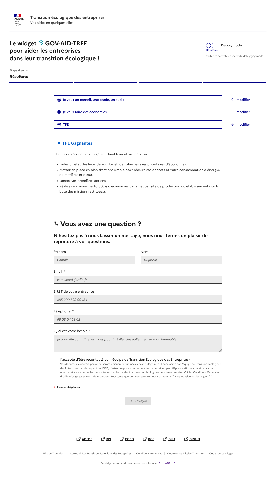

# Transition écologique des entreprises


---

## `WARNING : work in progress`

---

**A web component to help french entreprises finding public aid programs for 
their ecological transition.**

A project from the `transition-ecologique-entreprises` SE team.

--- 

<div style="display: flex; flex-direction: row;">
  
  
  
  
</div>

--- 

## Screenshots




## Project Setup

This repository is a monorepo, based on [npm 
workspaces](https://docs.npmjs.com/cli/v7/using-npm/workspaces/) composed of 
two workspaces:

- the ["web" workspace](./packages/web/README.md) contains the front-end implementations.

### Install dependencies for all repositories

```sh
npm install
```

### Build for all workspaces

```sh
npm run build
```


### Commands for a specific workspace

More scripts are define for each workspace: checout their respective 
documentation. 

Scripts can be triggered with:

```sh
npm run <script-name> -w packages/<workspace-name>
```
