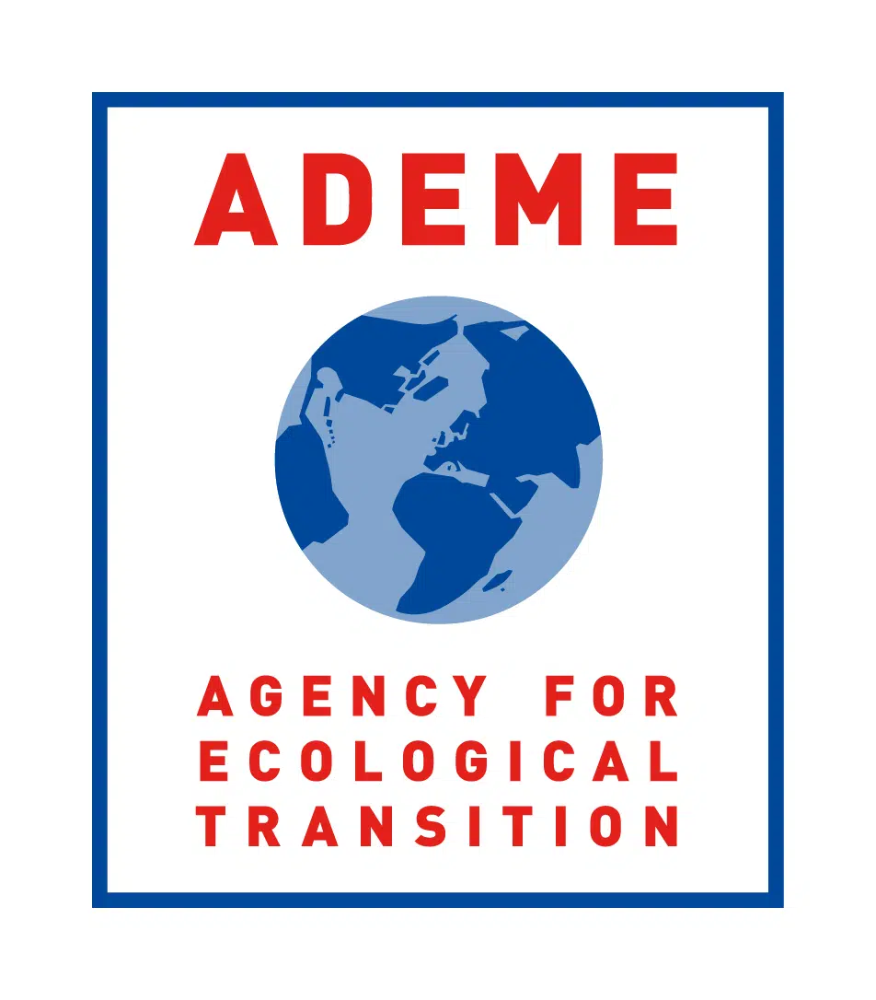

# Transition écologique des entreprises


---

## `WARNING : work in progress`

---

**An app + a web component + a dataset to help french entreprises finding public aid programs for their ecological transition.**

A project from the `transition-ecologique-entreprises` SE team.

- [Screenshots](#screenshots)
- [Project Setup](#project-setup)
  - [Stack](#stack)
  - [Description](#description)
  - [Getting started](#getting-started)
    - [NVM](#nvm)
    - [Environment variables](#environment-variables)
    - [Quick Start](#quick-start)
    - [Build](#build)
    - [Start services](#start-services)
    - [Development Mode](#development-mode)
    - [Commands for a specific workspace](#commands-for-a-specific-workspace)
- [Data validation](#data-validation)
- [Credits](#credits)
--- 

<div style="display: flex; flex-direction: row;">
  
  
  
  
</div>

--- 

## Screenshots


## Project Setup

### Stack

- [NodeJS](https://nodejs.org/) (v18)
- Back: [Express](http://expressjs.com/) (v4)
  - [tsoa](https://tsoa-community.github.io/docs/) (v5)
- Front: [VueJS](https://vuejs.org/) (v3)
  - Design system: [DSFR](https://www.systeme-de-design.gouv.fr/) 
     - Vue-dsfr: 
        - https://github.com/dnum-mi/vue-dsfr/tree/main
        - https://vue-dsfr.netlify.app/ (doc complete en cours de migration)
        - https://docs.vue-ds.fr/ (nouvelle doc en cours de rédaction)

### Description

This repository is a monorepo, based on [npm workspaces](https://docs.npmjs.com/cli/v7/using-npm/workspaces/) composed of two workspaces:

- the ["web" workspace](apps/nuxt/README.md) contains the front-end implementations.
- the ["backend" workspace](./libs/backend-ddd/README.md) contains the back-end implementations.
- the ["data" workspace](./libs/data/README.md) contains the datasets and common files for datasets builds.
- the ["web-e2e" workspace](apps/nuxt-e2e/README.md) contains the front-end end to end testing.

## Getting started

### NVM

The runtime is Node 18.x for this application.  
You can use [nvm](https://github.com/nvm-sh/nvm) to install this specific version.

```sh
# from the root folder of the project
nvm install
nvm use
```

### Environment variables

Some environment variables are needed for the services to work. Copy and modify the `.env.example` file from the folders (`back`/`data`/`web`) you want to build/start to `.env` in the same directory.

### Quick Start

If you want to run the project locally and quickly, you can use the following commands:

```sh
# from the root folder of the project
npm install
npm run start-all
```

- Go to http://localhost:4242/ to access the front-end

### Build

Use the following commands to build the project:

```sh
# All workspaces
npm run build
# Or for a specific workspace
npm run build-front # web
npm run build-back  # backend

# Or alternatively
npm run build -w packages/web
npm run build -w packages/backend
```

### Start services

Use the following commands to start the project:

```sh
# All workspaces
npm run start-all
# Or for a specific workspace
# Front-end
npm run start-front
# Back-end
npm run start-back

# Or alternatively
PORT=4242 npm run start --workspace packages/web
npm run start --workspace packages/backend
```

### Development Mode

To run the project in development mode, use the following commands:

```sh
# All workspaces
npm run dev
# Or for a specific workspace
# Front-end
npm run dev-front
# Back-end
npm run dev-back

# Or alternatively
npm run dev --workspace packages/web
npm run dev --workspace packages/backend
```

#### Linting and type check

- Linting is done with [eslint](https://eslint.org/) and type check with `tsc` or `vue-tsc` (typescript compiler).
```sh
npm run lint
# With fix
npm run lint:fix
# Type check on web workspace
npm run vue:type:check
```

- Lint sass files with [stylelint](https://stylelint.io/)

```shell
npm run lint:sass

# With fix
npm run lint:sass:fix
```

##### IDE configuration:  
  - Jetbrains  
https://www.jetbrains.com/help/webstorm/using-stylelint-code-quality-tool.html

  - Vsode  
https://marketplace.visualstudio.com/items?itemName=stylelint.vscode-stylelint


#### Preview front before deploying in production
```sh
# This script builds the front 
# and previews the produced index.html file from the dist folder
# on http://localhost:4242
npm run dev:build:start
```

### Commands for a specific workspace

More scripts are defined for each workspace: checkout their respective documentation and `package.json` file.

- backend: [README](./packages/backend/README.md) / [package.json](./packages/backend/package.json)
- data: [README](./packages/data/README.md) / [package.json](./packages/data/package.json)
- web: [README](apps/nuxt/README.md) / [package.json](./packages/web/package.json)

Scripts can be triggered with:

```sh
npm run <script-name> -w packages/<workspace-name>
```

---

## Data validation

Source program data are stored as YAML files, we use [JSON Schema](https://json-schema.org/) to validate every file.

The validations are triggered by Github CI on each pull request on preprod and main branches.

To run the validation tests manually, run:

```sh
npm run test-data -w packages/backend
```

## Scalingo, deployment and review apps
We use scalingo manifest json to deploy the app on scalingo with specific environment variables.
see [scalingo manifest](https://doc.scalingo.com/platform/app/app-manifest) for more details.

---

## Credits

- Team
  - Product owner: [Jean-Baptiste Le Dévéhat](https://jbledevehat.fr)
  - Coaching: Julien Rayneau
  - Designers: Coline Lebaratoux
  - Business Developers:
    - Céline Bagault
    - Manon Piffault 
    - Rodolphe GAGETTA
  - Maintainers - Developers:
    - [Yohann Valentin](https://yohannvalentin.com)
    - [Thibaut Tezenas Du Montcel](https://ttdm.github.io)
    - [Dorian Lemoine](https://github.com/dolemoine)
    - [Oumeima El Isbihani](https://multi.coop)
  - Old team members:
    - [Pierre Camilleri](https://multi.coop) (Maintainer - Developer)
    - [Julien Paris](https://multi.coop) (Maintainer - Developer)
