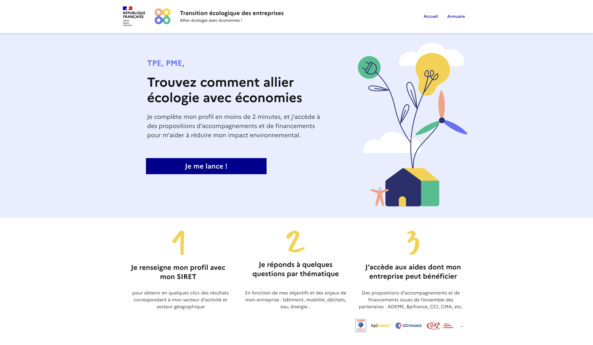
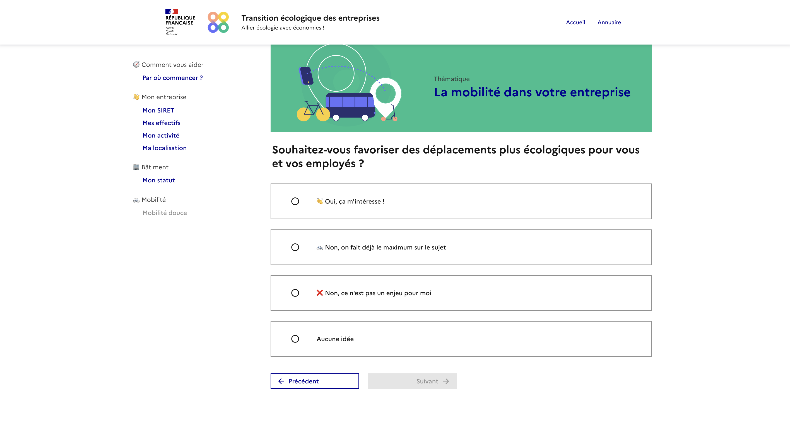
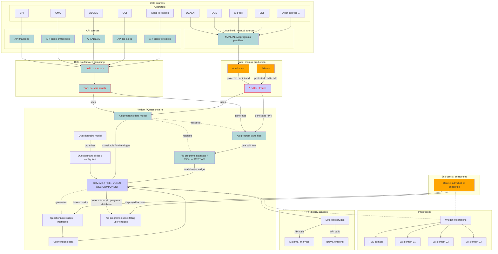
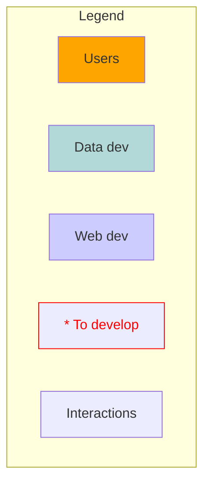

#  TEE-FRONTEND

**Decision tree interfaces + fit user's decision with a database**

---

**A web component to help french entreprises finding public aid programs for their ecological transition.**

A project from the `transition-ecologique-entreprises` SE team.

---

<div style="display: flex; flex-direction: row;">
  
  
  
  
</div>

---

## Screenshots



---



---

## Why this web component ?

This project aims to implement a flexible but simple way to display a questionnaire in a portable web component, and use the user's choices to select a subset from a dataset.

### Main challenges

#### 1. Making and updating an official aid programs dataset

Our first usecase points at the difficulty for french entreprises to find public aid programs helping them to engage in an ecological transition.

Such aid programs could be created at every administrative level (national, regional, local) by a wide diversity of actors.

Public aid programs are also very diverse : some could have conditions, some are limited in time, some are sectorial, some are limited to a geographic area, and so on...

To make a wide dataset of public aid programs we account for some necessary steps :

- Propose a schema to describe any aid program.
- Propose and implement a script able to regularly get and update the list of aids from providers, respecting the schema.
- Publish those aids in a way it is simple to request.

#### 2. Simplifying the research for end users

End users could be easily lost in the aid programs "jungle". The most inutitive way to help an user finding the right program(s) they need is to display a short questionnaire, and then at the end of the questionnaire select from all the aids the ones corresponding to their answers.

That being said the wide variety of aids prohibits us to think of an unique way to orient the user. We have to think of this matter as a problem of a dynamic decision tree.

Also the number and diversity of aid programs implies to think of a way enabling to easily change the questionnaire order.

- Conceptualise and implement a dynamic decision tree.
- Questionnaire with intuitive interfaces.
- Easy way to update / change the decision tree for maintainers.

#### 3. Give more visibility to the aid programs

The last main challenge is to give the widest possible visibility to the aids, in order to incite any entity to apply to these programs.

- Easy to implement / replicate in any partner's website.
- Publish the dataset in open data.

### The widget

This project is built to respond to those challenges. We made this project as :

- a web component (widget) to facilitate its replication and visibility ;
- based on a common schema for all aid programs ;
- based on a innovative way to describe a decision tree / questionnaire ;
- based on the principle of adaptability / customization, to be able to adapt it to other models or/and other questionnaires ;
- internationalisable, so to be able to implement it for users other than french-speaking ones ;
- open sourced... obviously !

---

### Functional diagram





---

## Focus on the questionnaire mecanism

**Disclaimer** : _The mecanism is freely inspired by `choose-your-own-adventure` books. You enter a chapter (here a `track`), a when the user clicks on a choice they are led to another chapter, and it goes on..._

All the questions for the questionnaire are splited into several files. Each file (or `track*.ts`) corresponds to a questionnaire's `track` ; a `track` presents several choices to the user.

The `index.ts` file (in the `./src/questionnaire` directory) builds up all the tracks into an array, array that could be used further by the main widget component `TeeApp`.

```
.
├── ...
├── src
|   ├── assets
|   ├── components
|   ├── questionnaire
|   |   ├── index.ts
|   |   ├── trackNeeds.ts
|   |   ├── trackSectors.ts
|   |   ├── trackStatus.ts
|   |   ├── trackResults.ts
|   |   ├── (other track files)
|   |   └── ...
|   ├── store
|   ├── translations
|   ├── types
|   ├── utils
|   └── ...
├── ...
└── README.md
```

Each `track` file is structured as follows :

```js
// .src/questionnaire/trackNeeds.sj

export const needs = {

  // track id
  id: 'track_needs',

  label: { fr: 'Votre besoin' },

  // UI options
  interface: {
    component: 'cards',
    columnWidth: 'auto',
  },

  // selection options
  behavior: {
    multipleChoices: false,
  },

  // next track (id) to display by default
  next: {
    default: 'track_sectors'
  },

  // choices array that could be used within this track
  options: [
    {
      disabled: true,

      // value to store if user selects this choice
      value: { project_needs: '*' },

      // content to display
      label: { fr: "Je souhaite tout voir d'un coup même si je n'y connais rien" },
      hint: { fr: "Oui, des fois on est juste très curieux... En vrai c'est pour tester mais faudra pas laisser ce bloc traîner quand on mettra en prod sinon les gens vont se foutre de notre gueule" },

      // next track (id) to display after this choice
      next: {
        default: 'track_results'
      }
    },
    ...
  ]
}
```

The widget's html contains a `seed` parameter : you need to specify here a track `id` (for instance `track_needs`) to tell the widget which track it should display first.

The user will see the questionnaire beginning with this first track, and its journey begins...

---

## Focus on the dataset

**Disclaimer** : _This strategy for building a dataset of aid programs is freely inspired from other projects, especially by the way [aides-jeunes](https://github.com/betagouv/aides-jeunes/tree/master/data/benefits/javascript) is building a collaborative dataset of aids from a set of yaml files._

The aid programs dataset is rebuilt as a unique `dataset_out.json` file at each deployment, based on a list of `yaml` files. This json file is exposed in the `./public` directory.

All the aids are described one by one in the `packages/data/programs` directory in distinct `yaml` files.

```
# in `./packages`
.
├── data
│   ├── README.md
│   ├── .env.example
│   ├── package-lock.json
│   ├── package.json
│   ├── src                            <-- scripts
│   │   └── BuildJsonOutput.ts
│   └── programs                       <-- all the aid described in a yaml format
│       ├── diag-decarbon-action.yaml
│       ├── diag-eco-flux.yaml
│       ├── diag-ecoconception.yaml
│       ├── fonds-tourisme-durable.yaml
│       ├── performa-environnement.yaml
│       ├── tpe-gagnantes.yaml
│       ├── tremplin.yaml
│       ├── visite-energie.yaml
│       └── ...
```

These `yaml` files could be built into a json file, with the following commands :

```sh
nvm use

# for a simple build
npm run build-json-output

# for a build and a watcher on yaml files
npm run build-json-output-watch
```

The generated `dataset_out.json` file is then created / updated in the `./packages/data/generated` folder.

```
# in `./packages/data`

.
├── ...
|   └── generated
|          └── dataset_out.json  <-- the json file used as a "database"
├── ...
└── README.md
```

At every run of the frontend app OR every run of the backend app, the json is built (in dev environnement the json is built and the yaml files are also watched). Doing so any new build (for instance triggered by a push/MR on the repo) will automatically keep updated the json dataset.

This strategy for building the dataset has several advantages :

- No need for a database technology (no use for a PostGreSQL / SQL / MongoDB...), we keep it simple in a json ;
- Any member of the team (especially not developpers) can add new yaml files to the repo, and the "database" will be updated without any need of a developer.

The json file as a static who store programs, are in the Pinia store (`./src/stores/program.ts`) for later uses :

Once in the store, programs can be filtered (cf `filterPrograms` function in `./src/stores/program.ts` ) depending on the choices made by the user during the questionnaire.

In order to filter aid programs corresponding to the user's choices, an aid program yaml file must contain a block of `conditions` - following more or less the [open fisca](https://fr.openfisca.org/) / [Publicodes](https://publi.codes/) syntax - such as :

```yaml
# ex. ../data/programs/diag-eco-flux.yaml

title: Diag Eco-flux
resume: Faites des économies en gérant durablement vos dépenses
description: ...
---
conditions:
  - type: project_needs
    operator: 'or'
    value:
      - advices
  - type: project_status
    operator: 'or'
    value:
      - economies
  - type: project_sectors
    operator: 'or'
    value:
      - '*'
  - type: structure_size
    operator: 'or'
    value:
      - pme
```

---

## Roadmap for the POC

Check : https://github.com/orgs/betagouv/projects/54/views/1

### Frontend

- [x] Set up a vue3 environment for custom element
- [x] Use the DSFR (Design System de l'Etat)
- [x] Develop interfaces for several dynamic research paths
- [x] Dynamic fit between aid programs and user choices
- [x] Send the form at the end of questionnaire to create / update contact on Brevo

### Data

- [x] Develop a schema for the aid programs provided by several sources
- [x] Develop a simple way to store and expose the aid programs dataset

---

## Backlog

### Data

- [x] Retrieve pertinent public data from the entreprise SIRET number
- [ ] Get and update aid programs dataset

---

## To copy the web component in a website

```html
<!-- In your html page -->
<gov-aid-tree-app
  id="main-widget"
  locale="fr"
  seed="track_needs"
  max-depth="3"
  debug-switch="false"
  debug="false"
>
</gov-aid-tree-app>
<script
  type="module"
  defer
  src="<DEPLOYMENT_URL>/widget.umd.js"
></script>
```

### Widget parameters

|   Parameter    | Status |   Type    | Default  | Definition                                        |
| :------------: | :----: | :-------: | :------: | ------------------------------------------------- |
| `show-header`  |  R&D   | `boolean` |  `true`  | Show / hide header on top of the widget           |
| `show-footer`  |  R&D   | `boolean` | `false`  | Show / hide footer on top of the widget           |
| `show-stepper` |  R&D   | `boolean` | `false`  | Show / hide stepper on top of the widget          |
| `show-message` |  R&D   | `boolean` | `false`  | Show / hide message on top of the widget          |
|     `msg`      |  R&D   | `string`  |  `...`   | Locale `Message on the top of the widget          |
|     `seed`     |  R&D   | `string`  | `needs`  | Questionnaire seed question                       |
|   `dataset`    |   x    | `string`  | `*.json` | Dataset file / url to select from to find results |
|  `max-depth`   |   x    | `number`  |   `4`    | Maximum number of questions before results        |
|    `locale`    |   x    | `string`  |   `fr`   | Default language                                  |
| `debug-switch` |   ok   | `boolean` | `false`  | Show / hide the debug switch                      |
|    `debug`     |   ok   | `boolean` | `false`  | Debug mode on / off                               |

---

### Environment variables

The `env` variables you can use for deployment are listed in the `.env.example` file.

```env
# To hide the "debug" switch
# If this variable is set to 'true'
# it overrides the `debug-switch` parameters to prohibit debug mode
VITE_NO_DEBUG_SWITCH = false

# To indicate built source while copying the widget
VITE_DEPLOY_URL = https://tee-frontend.osc-fr1.scalingo.io

# To set up global contact email
VITE_CONTACT_EMAIL = contact@mission-transition-ecologique.beta.gouv.fr

# To set up Matomo analytics
# Note : if VITE_MATOMO_DEACTIVATE is set to 'true' it prohibits the tracking
# even if VITE_MATOMO_URL and VITE_MATOMO_APP_ID are correctly set
VITE_MATOMO_DEACTIVATE = true
VITE_MATOMO_URL = https://stats.beta.gouv.fr
VITE_MATOMO_APP_ID = 42

# To indicate the backend url
VITE_TEE_BACKEND_URL=https://tee-backend.osc-fr1.scalingo.io
```

---

### Legacy projects

- Aides territoires + Mission transition
  - http://mission-transition.beta.gouv.fr/
  - http://mission-transition.beta.gouv.fr/integration

### Projet TEE

- https://www.figma.com/file/tHgzORFkJYTVspsQgR2kg6/TEE-V5
- https://docs.google.com/presentation/d/1zP32OOaRsVEgPTaIXjWUxq3DccR79m4Zv8blfJa-0vQ/edit#slide=id.g22df2b368bb_0_655
- https://whimsical.com/offres-aux-entreprises-dans-la-tee-2gHnT3nFgRZs32pa7aYmPL

### Aid programs APIs

- API - Liste des aides Entreprises sur AGIR :
  - https://agirpourlatransition.ademe.fr/entreprises/aides-financieres/recherche?aap%5B0%5D=vous_etes%3AEntreprise
  - https://ppd-x-ademe-externe-api.de-c1.eu1.cloudhub.io/api/v1/r2da/listeDispositif (needs client secret token)
- API - Aides-territoires : https://aides-territoires.beta.gouv.fr/api/swagger/
  - https://github.com/MTES-MCT/aides-territoires/wiki/Comment-publier-vos-donn%C3%A9es-pour-une-reprise-sur-Aides-territoires
  - https://aides-territoires.beta.gouv.fr/api/swagger/?version=1.4
- API - Aides 1 jeune 1 solution :
  - https://mes-aides.1jeune1solution.beta.gouv.fr/api/benefits
  - https://github.com/betagouv/aides-jeunes/blob/master/contribuer/public/admin/config.yml
  - https://github.com/betagouv/aides-jeunes/tree/master/data/benefits/javascript
  - https://contribuer-aides-jeunes.netlify.app/admin/#/
  - (contribution w/ Netlify CMS) https://github.com/betagouv/aides-jeunes/tree/master/data/benefits/javascript

### Links and references

- Questionnaires
  - https://diag.bpifrance.fr/
  - https://clic-agil.climaxion.fr/
  - https://entreprendre.service-public.fr/vosdroits/N31906
- Schemas / aid data models
  - https://schema.data.gouv.fr/etalab/schema-dispositif-aide/0.0.2/documentation.html#propriete-condition-eligibilite
  - https://github.com/MTES-MCT/aides-territoires/wiki/Format-des-donn%C3%A9es-publi%C3%A9es-sur-Aides-territoires
  - https://www.insee.fr/fr/information/2406147
  - https://publi.codes/
  - cf "open fisca"
  - cf "mon entreprise"
- Others
  - https://www.entreprises.gouv.fr/files/files/secteurs-d-activite/industrie/decarbonation/transition-ecologique-guidedes-aides-pour-les-tpe-pme.pdf
  - https://www.gouvernement.fr/france-nation-verte
  - https://place-des-entreprises.beta.gouv.fr/aide-entreprise/accueil/theme/environnement-transition-ecologique
  - https://agirpourlatransition.ademe.fr/entreprises/aides-financieres/2022/tremplin-transition-ecologique-pme

---

## Data models - (R&D)

All documentation about data models and references are on our [SE Notion space](https://www.notion.so/Accueil-93eb32ce96dc464cbdbe2154e13c8eea?pvs=4)

---

## Stack

- Type script
- Vuejs 3
- Vite
- Design System de l'Etat

### Technical references / tutorials

- create vue app + vite : https://github.com/vuejs/create-vue
- vue3 + typescript :
  - https://blog.logrocket.com/how-to-use-vue-3-typescript/
  - https://dev.to/nurlan_tl/tips-to-create-web-components-using-vue-3-ts-vite-3a7a
- vue + vite + nuxt + dsfr : https://github.com/laruiss/create-vue-dsfr
- vue3 composition API :
  - https://vuejs.org/guide/extras/composition-api-faq.html
  - https://vuejs.org/guide/reusability/composables.html
- issues templates : https://github.com/stevemao/github-issue-templates/tree/master

---

## Recommended IDE Setup

[VSCode](https://code.visualstudio.com/) + [Volar](https://marketplace.visualstudio.com/items?itemName=Vue.volar) (and disable Vetur) + [TypeScript Vue Plugin (Volar)](https://marketplace.visualstudio.com/items?itemName=Vue.vscode-typescript-vue-plugin).

### VSCode: Type Support for `.vue` Imports in TS

TypeScript cannot handle type information for `.vue` imports by default, so we replace the `tsc` CLI with `vue-tsc` for type checking. In editors, we need [TypeScript Vue Plugin (Volar)](https://marketplace.visualstudio.com/items?itemName=Vue.vscode-typescript-vue-plugin) to make the TypeScript language service aware of `.vue` types.

If the standalone TypeScript plugin doesn't feel fast enough to you, Volar has also implemented a [Take Over Mode](https://github.com/johnsoncodehk/volar/discussions/471#discussioncomment-1361669) that is more performant. You can enable it by the following steps:

1. Disable the built-in TypeScript Extension

- Run `Extensions: Show Built-in Extensions` from VSCode's command palette
- Find `TypeScript and JavaScript Language Features`, right click and select `Disable (Workspace)`

2. Reload the VSCode window by running `Developer: Reload Window` from the command palette.

## Customize configuration

See [Vite Configuration Reference](https://vitejs.dev/config/).

---

## Project Setup

```sh
npm install
cp .env.example .env
```

### Development mode

#### Compile and Hot-Reload for Development

```sh
npm run dev
```

Should run on `http://localhost:4242`

#### Lint with [ESLint](https://eslint.org/)

```sh
npm run lint
```

#### Run Unit Tests with [Vitest](https://vitest.dev/)

```sh
npm run test:unit
```

#### Run End-to-End Tests with [Cypress](https://www.cypress.io/)

```sh
npm run test:e2e:dev
```

This runs the end-to-end tests against the Vite development server.
It is much faster than the production build.

### Production Mode

#### Type-Check, Compile and Minify for Production

```sh
npm run build
```

#### Run End-to-End Tests with [Cypress](https://www.cypress.io/) on Production Build

It's still recommended to test the production build with `test:e2e` before deploying (e.g. in CI environments):

```sh
npm run build
npm run test:e2e
```
